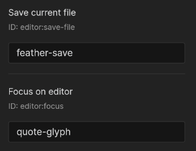

# Obsidian Advanced Toolbar Plugin  

This Plugin enhances the Mobile Toolbar, enabling it to be always visible and to show multiple Rows at the same time. You can also add Custom Icons for Quick Actions that don't have Icons otherwise.

## Custom Icons

You can add Custom Icons (even [Feather Icons](https://feathericons.com/)) to any Quick Actions that dont have their own Icon already (Please let me know if you want to change Icons of every Quick Action).
For that just go into this Plugin's Settings and if you have any Quick Actions without Icons enabled you can change the Icon via the Button. 

## Tips

I recommend using this Plugin together with [@Vinzent03](https://github.com/Vinzent03/)'s [Hotkeys for Templates](https://github.com/Vinzent03/obsidian-hotkeys-for-templates) Plugin which allows you to insert Templates via your Toolbar.

1. Install both this and the Hotkeys for Templates Plugin
2. In the Settings of the Hotkeys for Templates Plugin enable a Command for a Template
3. Add it to the Toolbar in the Mobile Section of the Settings
4. Finally add a fancy Icon using this Plugin

## How to install

1. Go to **Community Plugins** in your [Obsidian](https://www.obsidian.md) Settings and **disable** Safe Mode
2. Click on **Browse** and search for „Obsidian Advanced Toolbar“
3. Click install
4. Toggle the Plugin on in the **Community Plugins** Tab

## Support me

If you find this Plugin helpful, consider supporting me:

